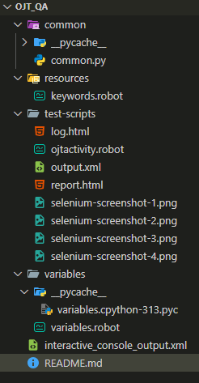

short simple automation

REQUIREMENTS
 Install Python
 Go to https://www.python.org/, download and install Python 3.x.x

 Install Selenium Library
# Installing a specific version
$ pip install robotframework-selenium2Library
# Upgrading library
$ pip install –upgrade robotframework-selenium2Library

<-------------------------------------------------------------->
Install Robot Framework
Execute the commands below:
# Install the latest version (does not upgrade)
$ pip install robotframework
py -m pip install robotframework
# Upgrade to the latest stable version
$ pip install –upgrade robotframework
# Installing a specific version
$ pip install –upgrade robotframework==x.x.x
 Verify Installation

 After a successful installation, you should be able to execute the command below and get the current Robot Framework version that was installed on your system.

#$ robot --version
SCRIPT STRUCTURE

test automation structure

result structure

***TO RUN ROBOT***
[robot keyword.robot]